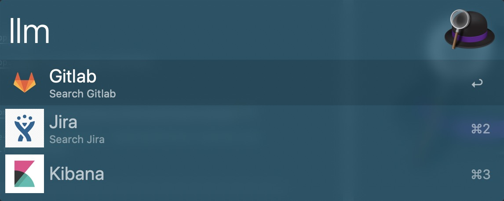

# Alfred Workflows

A collection of [Alfred 3 and 4](https://www.alfredapp.com/) workflows.

## Install

Download and open file using [Alfred](https://www.alfredapp.com/).

P.S.: You need to [buy the Powerpack](https://buy.alfredapp.com/) to use these workflows.

## Workflows

:arrow_down: **&nbsp;[Download them all](https://github.com/nickccm1122/nickccm-alfred-workflows/releases).**

### [LLM](https://github.com/shawnrice/alfred-2-caffeinate-workflow) (v1.0.0) ~ [Download](https://github.com/nickccm1122/nickccm-alfred-workflows/raw/master/llm/llm.alfredworkflow)

My lalamove workflows

> Triggers: `llm`.

